# Bastion — Architecture

Bastion is a **policy firewall for Solana**. A wallet owner delegates _narrow, short-lived, revocable_ authority to an agent (AI trader, bot, dApp), and every action that delegate takes is enforced **on-chain** by a composable set of policy accounts.

This document explains how the whole system fits together. It is the source of truth; the per-package READMEs link here for the big picture.

- On-chain program: [`programs/bastion`](programs/bastion/README.md) (Anchor)
- TypeScript SDK (`bastion`): [`sdk`](sdk/README.md) (`@solana/kit`-native)
- Example agent: [`examples/bot`](examples/bot/README.md)

Sections:

1. [The core idea](#1-the-core-idea)
2. [System components](#2-system-components)
3. [The two-key trust model](#3-the-two-key-trust-model)
4. [On-chain account model](#4-on-chain-account-model)
5. [Custody modes — allowance vs vault](#5-custody-modes--allowance-vs-vault)
6. [The execute pipeline](#6-the-execute-pipeline)
7. [Policies](#7-policies)
8. [Batches and sequences](#8-batches-and-sequences)
9. [Scaling axes](#9-scaling-axes)
10. [SDK architecture](#10-sdk-architecture)
11. [Session lifecycle](#11-session-lifecycle)
12. [Security invariants](#12-security-invariants)
13. [Repository layout](#13-repository-layout)

---

## 1. The core idea

An agent should be able to act on a wallet **autonomously** — but only inside hard limits the owner sets, and never with the power to drain the wallet. Bastion achieves that with three moving parts:

- a **session key** the agent holds (disposable, can only call `execute`),
- a **delegate PDA** that is the _only_ signer allowed for the wrapped action (a PDA has no private key — only the program can make it sign), and
- **policy accounts** the program checks on every call.

The agent never sees the owner key. Every wrapped transaction routes through the program, which validates it against the attached policies, charges windowed counters / spend caps, and only then CPIs into the target program. Any failure reverts the whole transaction atomically.

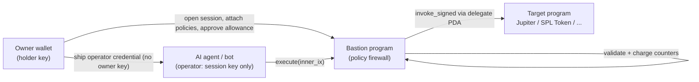

---

## 2. System components

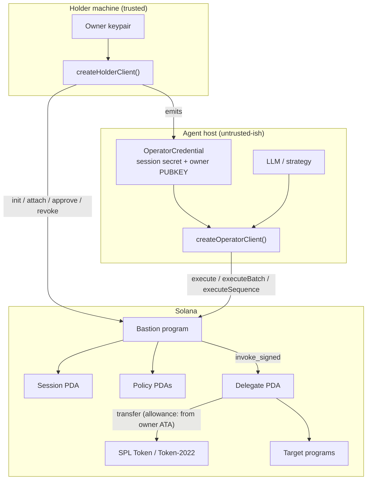

The **holder machine** keeps the owner key and runs admin operations. The **agent host** only ever holds an operator credential — the session secret plus the owner _public_ key — so a full compromise of the agent host cannot move funds outside policy.

---

## 3. The two-key trust model

This is the security spine. Two distinct keys, never combined:

| Key                          | Who holds it                | Can do                                                                 | Cannot do                                                        |
| ---------------------------- | --------------------------- | ---------------------------------------------------------------------- | ---------------------------------------------------------------- |
| **Holder** (= owner)         | the human, on their machine | open/attach/update/detach/extend/revoke/close/sweep, approve allowance | —                                                                |
| **Operator** (= session key) | the agent, shippable        | `execute` (policy-gated) + reads                                       | change policies, move funds outside policy, sign owner transfers |

On-chain, `execute` requires **only** the `session_key` signer; the owner is not even an account on it. `init_session` enforces `session_key ≠ owner`, so the two can never collapse into one. Because the SPL `approve` targets the **delegate PDA** (not the session key), a fully leaked operator credential is bounded by `min(policy caps, approve allowance)` and **cannot drain**.

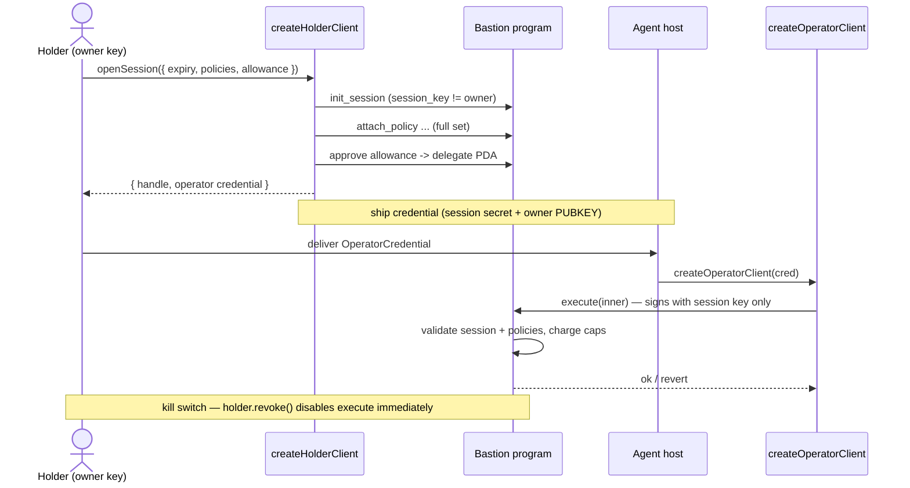

The credential is JSON-serializable: `{ sessionSecret, sessionPda, owner, programId, policies[], rpcUrl, wsUrl? }`. `sessionSecret` is the 32-byte session seed (base58); `owner` is a public key only. There is no field that could hold an owner private key.

---

## 4. On-chain account model

Three account types. PDAs are derived deterministically, so the SDK never stores addresses it can recompute.

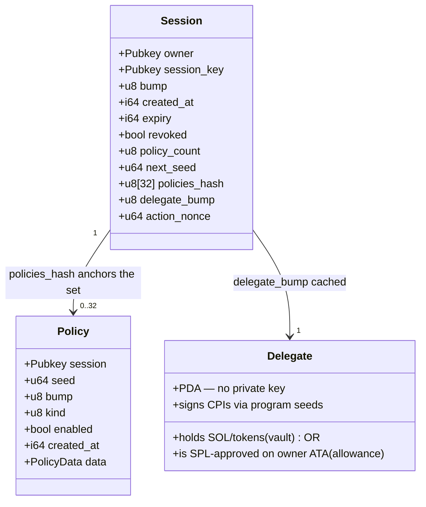

PDA seeds:

| Account      | Seeds                                                                     |
| ------------ | ------------------------------------------------------------------------- |
| **Session**  | `["session", owner, session_key]`                                         |
| **Policy**   | `["policy", session, seed_le_u64]` (seed = `Session.next_seed` at attach) |
| **Delegate** | `["delegate", owner, session_key]` (bump cached on `Session`)             |

`Session.policies_hash` is a **SHA-256** commitment over the child Policy keys. `execute` rejects any caller that does not pass the exact set (count + hash) the session expects — defending against an old, forged, or partial policy set being substituted at call time. `action_nonce` is a monotonic counter (one increment per `execute`) used for optional multi-tx ordering.

---

## 5. Custody modes — allowance vs vault

Bastion supports two ways for the delegate to move value. Both are gated by the same policy pipeline; they differ only in _where the funds live_.

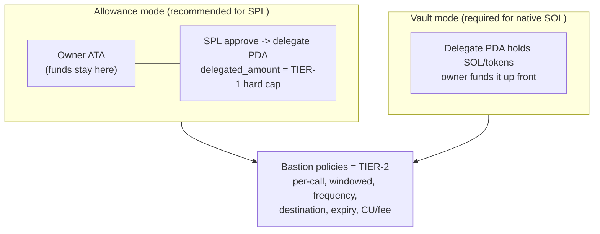

- **Allowance** (SPL/Token-2022 only): the owner `approve`s the delegate PDA on the owner's ATA. Funds never leave the owner wallet; the agent spends them directly from the owner ATA via policy-gated `execute`. The SPL `delegated_amount` is a **tier-1** ceiling enforced by the token program itself; Bastion policies are the **tier-2** per-call/windowed controls.
- **Vault**: the delegate PDA holds the funds. Required for **native SOL** (SOL has no `approve`). `sweep_delegate` reclaims the balance once the session is revoked.

Spend is measured on the **stable token-account owner field**, not the volatile SPL `delegate` field (which clears when an allowance is exhausted), so accounting stays correct across allowance exhaustion.

---

## 6. The execute pipeline

`execute` is the only hot path. It takes a **batch** of wrapped instructions and an optional nonce:

```
execute(wrapped_ixs: Vec<WrappedInstruction>, policy_count: u8, expected_nonce: Option<u64>)
```

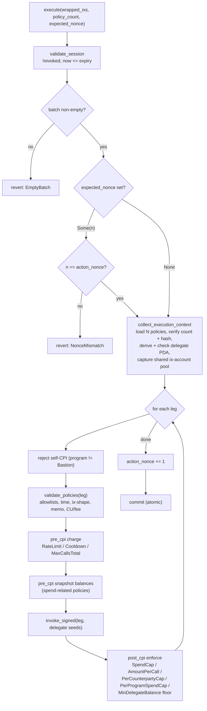

Every leg runs the full pipeline against the **shared** policy set and **shared** ix-account pool. Because all legs run inside one instruction, a failure in any leg reverts the entire transaction — there is no partial commit. Frequency and spend state accumulate per leg (a batch behaves like N back-to-back `execute`s at the same timestamp).

**Why two phases for spend policies:** the pre-CPI snapshot captures the relevant balance before the wrapped ix runs; the post-CPI phase re-reads it, computes the delta, and charges the windowed counter. This enforces "spend at most X per window" from the _effect_ on accounts, without trusting the wrapped instruction's bytes.

---

## 7. Policies

24 policy kinds. They split cleanly by **what they need to evaluate**, which also determines where they can live (see [§9](#9-scaling-axes)):

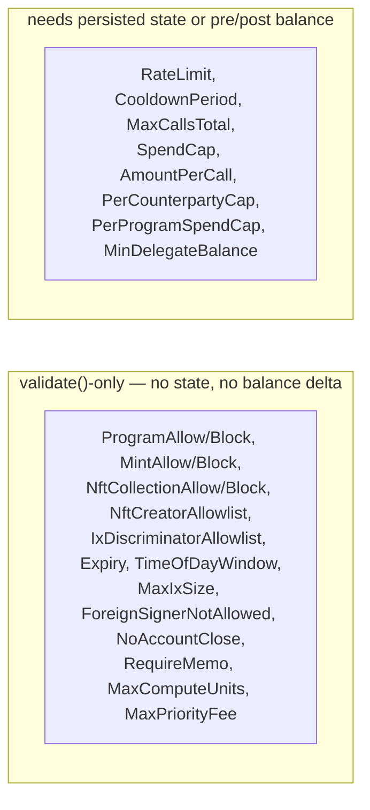

**Full-set enforcement:** every `execute` must present the entire policy set the session committed to (`policy_count` + `policies_hash`), so the operator can never silently drop a policy.

**Window kinds:** `Fixed { secs }` resets at the boundary; `Rolling { secs, slots }` is a sliding ring of up to 8 slots.

**Asset kinds:** `NativeSol`, `SplToken(mint)`, `Token2022(mint)` (plus reserved NFT-count variants).

For the full per-policy table (asset/scope/state/notes) see the [program README](programs/bastion/README.md#policy-kinds).

---

## 8. Batches and sequences

Bastion gives the agent three ways to act, trading atomicity for capacity:

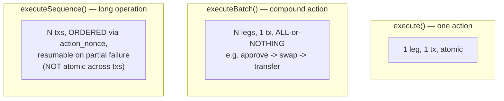

- **`executeBatch`** packs multiple legs into one transaction sharing a deduplicated account pool — atomic.
- **`executeSequence`** submits legs as ordered transactions, threading `expected_nonce` so stale/out-of-order submissions are rejected; on a partial failure it returns the completed steps and the failing index, so the caller can resume.

> Solana has no cross-transaction atomicity. `executeSequence` is _ordered and replay-safe_, not all-or-nothing. Use `executeBatch` when you need atomicity and the work fits in one transaction.

---

## 9. Scaling axes

"How much can one session do" scales along four orthogonal axes. Each has one job; they compose.

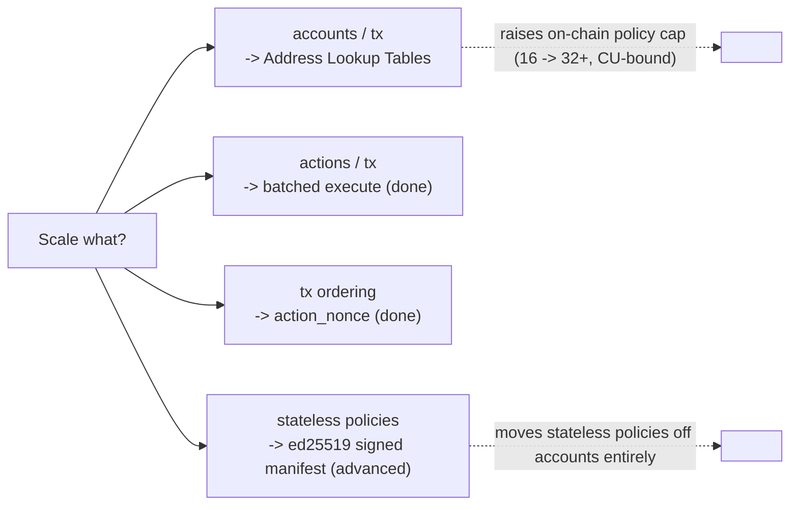

- **Address Lookup Tables** are the only lever that raises the per-tx _account_ ceiling (introspection cannot — a transaction's account list is shared across all instructions). The on-chain policy cap is **32**. The holder creates an ALT (`handle.createLookupTable` / `openSession({ useLookupTable: true })`); the operator compresses its `execute` tx against it (`cred.lookupTable`).
- **Batched execute** raises actions per transaction — shipped.
- **`action_nonce`** gives ordered, replay-safe multi-tx sequences — shipped.
- **Signed manifest** _(advanced)_: the holder ed25519-signs the **stateless** policy set off-chain (`holder.signManifest`), pins its hash on the session (`handle.pinManifest`), and the operator attaches `{ policies, signature }` to `execute({ manifest })`. The program verifies it via the ed25519 precompile + instruction introspection (signer == owner, message == the pinned hash) and rejects any stateful entry. This moves stateless policies off the account list entirely; stateful policies (which need persisted counters) stay on-chain.

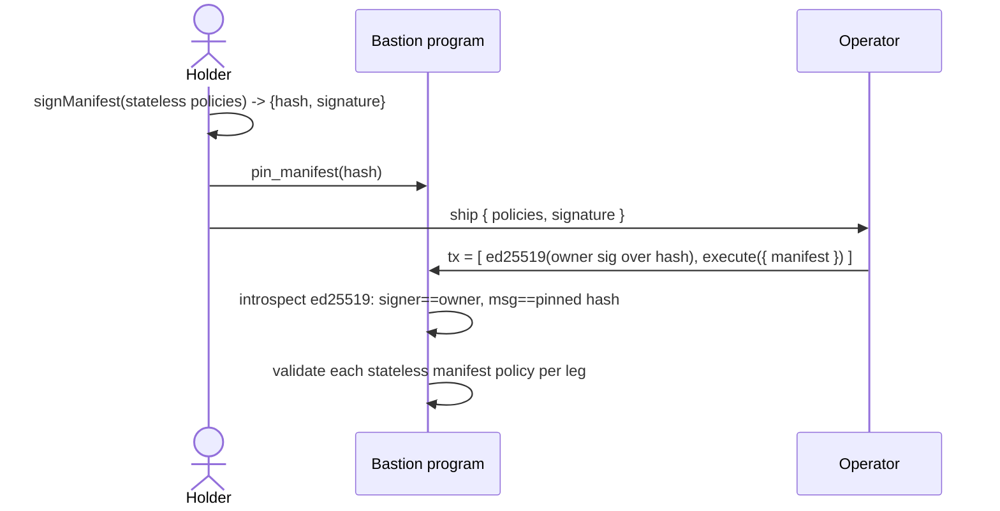

---

## 10. SDK architecture

The SDK (`bastion`) is `@solana/kit`-native, ESM-only, with `@solana/kit` and `@solana/program-client-core` as peer dependencies. The codama-generated client is bundled and re-exported.

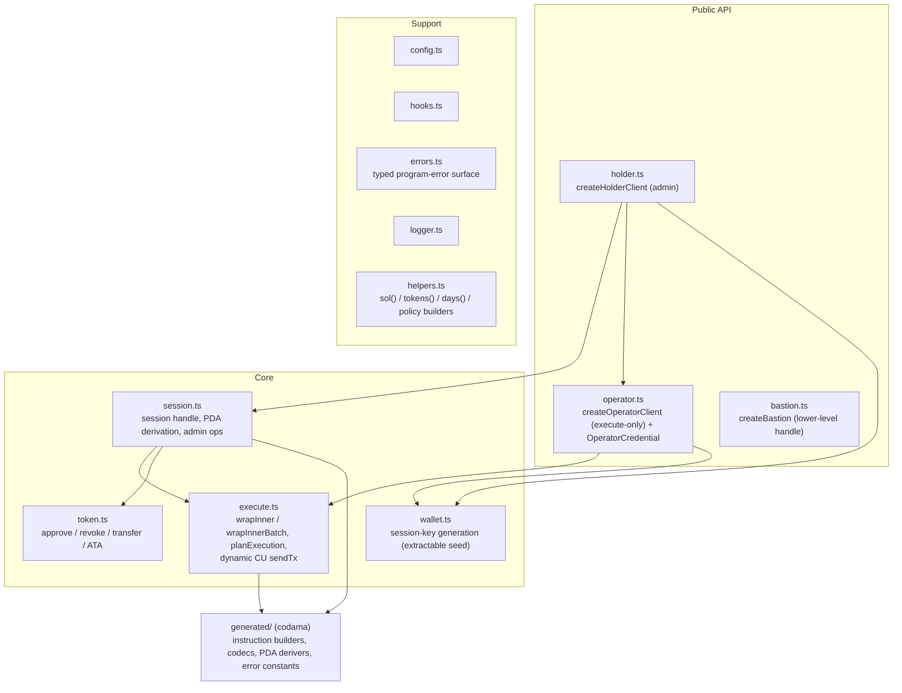

Typical flow: the holder builds the session and emits a credential; the operator reconstructs from the credential and calls `execute*`. The `execute.ts` module owns the wire-format details (compacting inner-ix accounts into the shared pool, planning compute-budget instructions, building the transaction).

---

## 11. Session lifecycle

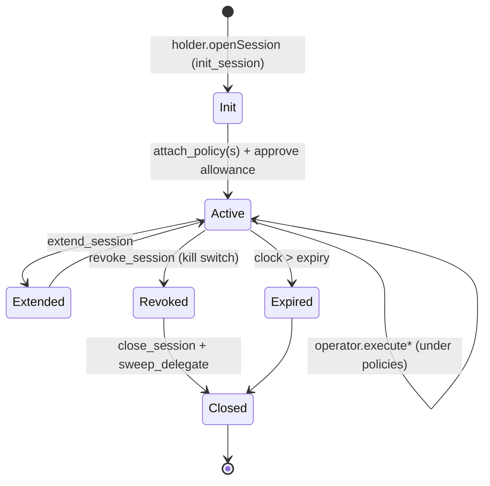

Only the **owner** can mutate policies or lifecycle (`attach`/`update`/`detach`/`revoke`/`extend`/`close`/`sweep`). The **session key** can only `execute`, within policy bounds. `revoke_session` disables `execute` immediately; `sweep_delegate` reclaims any vault funds after revocation.
