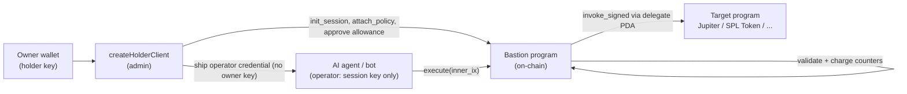
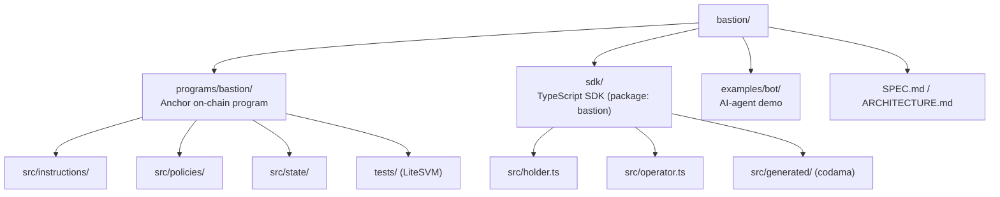

# Bastion

A **policy firewall for Solana**. Bastion lets a wallet owner delegate _narrowly scoped_, _short-lived_, _revocable_ authority to an AI agent, trading bot, or dApp — and have every action that delegate takes enforced on-chain by a composable set of policy accounts.

The agent never sees the owner's private key. It holds a disposable **session key** and a shippable **operator credential**. Every wrapped transaction routes through the Bastion program, which validates the request against the policies the owner attached, charges windowed counters / spend caps, and only then CPIs into the target program via a **delegate PDA** (which has no private key — only the program can make it sign).

---

## What it gives you



A single `execute` call:

1. Validates the session (not revoked, not expired) and optional nonce ordering.
2. Loads the attached policies and verifies the count + SHA-256 hash match what the session expects.
3. For each wrapped leg: runs every policy's pre-CPI check, charges frequency counters, snapshots spend balances.
4. CPIs into the target program via the delegate PDA's signer seeds.
5. Re-snapshots, charges spend / per-counterparty / per-program caps, enforces rent-exempt + min-balance floors.
6. Increments `action_nonce`.

Any failure at any step reverts the whole transaction atomically.

---

## The two-key model

Two distinct keys, never combined — this is the security spine ([details](ARCHITECTURE.md#3-the-two-key-trust-model)):

| Key                        | Holder                           | Can do                                   | Cannot do                                    |
| -------------------------- | -------------------------------- | ---------------------------------------- | -------------------------------------------- |
| **Holder** (owner)         | the human                        | open / attach / approve / revoke / sweep | —                                            |
| **Operator** (session key) | the agent (shippable credential) | `execute` + reads                        | change policies, drain, sign owner transfers |

`execute` requires only the session-key signer; `init_session` enforces `session_key ≠ owner`; the SPL `approve` targets the delegate PDA. So a fully leaked operator credential is bounded by `min(policy caps, approve allowance)` and **cannot drain**.

---

## Repository layout



---

## Quick start

```bash
# 1. Install workspace deps
pnpm install

# 2. Build the on-chain program (.so + IDL)
anchor build            # or: cargo build-sbf --manifest-path programs/bastion/Cargo.toml

# 3. Run the test suite
anchor run testall              # Rust unit + LiteSVM integration
pnpm test                       # SDK (vitest)
```

---

## SDK example — two-key

```ts
import {
    createHolderClient,
    createOperatorClient,
    serializeOperatorCredential,
    parseOperatorCredential,
    policyData as P,
    asset as A,
    windowKind as W,
    sol,
    days,
} from "bastion";

// --- HOLDER side (owner machine) ---
const holder = createHolderClient({
    url: "https://api.devnet.solana.com",
    wallet,
});

const { handle, operator } = await holder.openSession({
    expiry: { secsFromNow: days(1) },
    policies: [
        P.programAllowlist({ programs: [JUPITER, SPL_TOKEN] }),
        P.spendCap({ asset: A.sol(), window: W.fixed(days(1)), max: sol(50) }),
        P.cooldownPeriod({ secs: 5 }),
    ],
    // allowance: { mint, amount },   // SPL: spend straight from the owner ATA
});

// ship this to the agent — it contains the session secret + owner PUBKEY, never the owner key
const credentialJson = serializeOperatorCredential(operator);

// --- OPERATOR side (agent host) ---
const op = await createOperatorClient(parseOperatorCredential(credentialJson));
await op.execute({ inner: jupiterSwapIx }); // one atomic action
await op.executeBatch({ inners: [approveIx, swapIx] }); // compound, all-or-nothing

// --- kill switch (holder) ---
await handle.revoke();
```

See [`sdk/README.md`](sdk/README.md) for the full API (batches, ordered sequences, hooks, error surface).

---

## Use cases

| Scenario                    | Policy stack                                                                           |
| --------------------------- | -------------------------------------------------------------------------------------- |
| AI trading agent            | `programAllowlist` + `spendCap` + `amountPerCall` + `maxCallsTotal` + `cooldownPeriod` |
| DAO treasury payout agent   | `spendCap` + `perCounterpartyCap` + `timeOfDayWindow` + `requireMemo`                  |
| NFT sweeper                 | `nftCreatorAllowlist` + `perCounterpartyCap` + `maxCallsTotal`                         |
| Customer-service refund bot | `perProgramSpendCap` + `cooldownPeriod` + `maxCallsTotal` + `minDelegateBalance`       |

---

## Where to go next

| If you want to…                                                       | Read                                                       |
| --------------------------------------------------------------------- | ---------------------------------------------------------- |
| Understand the whole system                                           | [`ARCHITECTURE.md`](ARCHITECTURE.md)                       |
| Understand the on-chain program (PDAs, execute pipeline, 24 policies) | [`programs/bastion/README.md`](programs/bastion/README.md) |
| Build with the TypeScript SDK                                         | [`sdk/README.md`](sdk/README.md)                           |
| See a real agent gated by Bastion                                     | [`examples/bot/README.md`](examples/bot/README.md)         |
