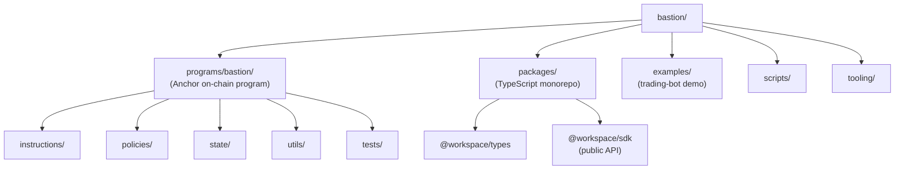
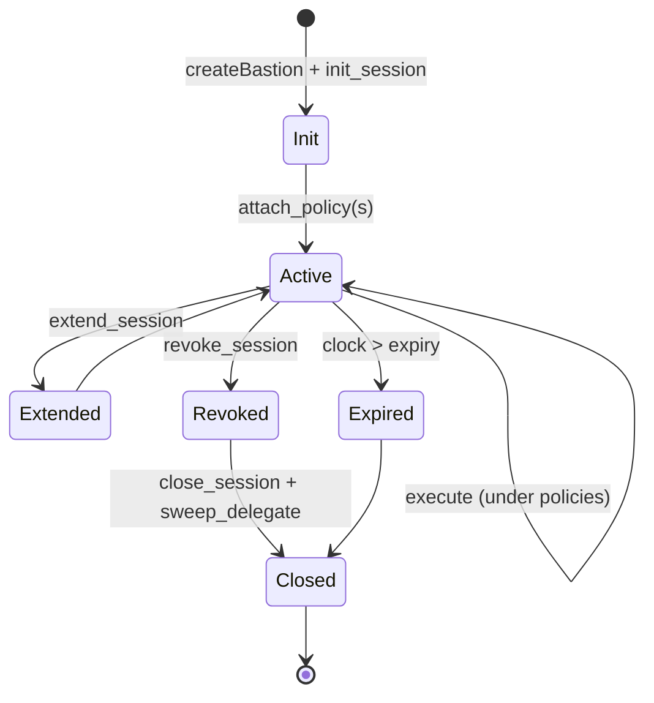

# Bastion

A policy firewall for Solana. Bastion lets a wallet owner delegate _narrowly scoped_, _short-lived_ authority to an AI agent, trading bot, or dApp — and have every action that delegate takes enforced on-chain by a composable set of policy accounts.

The agent never sees the owner's private key. It signs with a disposable **session key**. Every wrapped transaction routes through the Bastion program, which validates the request against the policies the owner attached, charges windowed counters / spend caps, and only then CPIs into the target program.

---

## What it gives you

```mermaid
flowchart LR
    Owner["Owner wallet"]
    SDK["@workspace/sdk<br/>(TypeScript)"]
    Program["Bastion program<br/>(on-chain)"]
    Agent["AI agent / bot<br/>(holds session key)"]
    Target["Target program<br/>(Jupiter, SPL Token, etc.)"]

    Owner -->|attach policies| SDK
    SDK -->|init_session, attach_policy| Program
    Owner -->|hand over session key| Agent
    Agent -->|execute&#40;inner_ix&#41;| Program
    Program -->|validate + charge counters| Program
    Program -->|invoke_signed via Delegate PDA| Target
```



A single execute call:

1. Validates the session (not revoked, not expired).
2. Loads attached policies and verifies the hash matches what the session expects.
3. For each policy, runs its pre-CPI check (allowlist, time window, ix shape, etc.).
4. For spend-related policies, snapshots the relevant balance pre-CPI.
5. CPIs into the target program via the delegate PDA's signer seeds.
6. Re-snapshots post-CPI, charges spend / per-counterparty / per-program caps, and enforces the rent-exempt + min-balance floors.

Any failure at any step reverts the whole tx atomically.

---

## Repository layout



## Session lifecycle



The owner is the only authority that can `attach_policy`, `update_policy`, `detach_policy`, `revoke_session`, `extend_session`, or `close_session`. The session key can only call `execute`, and only within the bounds defined by attached policies. The delegate PDA holds funds and SPL approvals; only `execute` can transact through it; `sweep_delegate` (owner) reclaims everything once the session is revoked.

---

## Quick start

```bash
# 1. Install workspace deps + build the on-chain program
pnpm install
anchor build

# 2. Run the full test suite (Rust unit + LiteSVM integration + TS)
anchor run testsvm
anchor run testunit
pnpm test

# 3. Try the demo: a Vercel AI SDK trading agent gated by Bastion
cp examples/trading-bot/.env.example examples/trading-bot/.env
# edit .env with ANTHROPIC_API_KEY (or OPENAI_API_KEY)
pnpm demo
```

---

## The 5-line SDK example

```ts
import { createBastion, P, W, A, sol, days, T } from "@workspace/sdk";

const bastion = createBastion({ url: "https://api.devnet.solana.com", wallet });

const session = await bastion.openSession({ expiresIn: days(1) });
await session.attachMany([
    P.programAllowlist({ programs: [JUPITER, SPL_TOKEN] }),
    P.spendCap({ asset: A.sol(), window: W.fixed(days(1)), max: sol(50) }),
    P.timeOfDayWindow({
        startMinute: 9 * 60,
        endMinute: 17 * 60,
        daysMask: T.workdays,
    }),
    P.cooldownPeriod({ secs: 5 }),
]);

await session.execute({ inner: jupiterSwapIx });
await session.revoke();
```

That's the contract: typed numeric helpers (`sol(50)`, `days(1)`), composable policy builders, a single `execute` that goes through the full pipeline.

---

## Use cases

| Scenario                    | Policy stack                                                                           |
| --------------------------- | -------------------------------------------------------------------------------------- |
| AI trading agent            | `programAllowlist` + `spendCap` + `amountPerCall` + `maxCallsTotal` + `cooldownPeriod` |
| DAO treasury payout agent   | `spendCap` + `perCounterpartyCap` + `timeOfDayWindow` + `requireMemo`                  |
| NFT sweeper                 | `nftCreatorAllowlist` + `perCounterpartyCap` + `maxCallsTotal`                         |
| Customer-service refund bot | `perProgramSpendCap` + `cooldownPeriod` + `maxCallsTotal` + `minDelegateBalance`       |

---

## Where to go next

| If you want to…                                                               | Read                                                       |
| ----------------------------------------------------------------------------- | ---------------------------------------------------------- |
| Understand the on-chain program (PDAs, execute pipeline, all 24 policy kinds) | [`programs/bastion/README.md`](programs/bastion/README.md) |
| Build with the TypeScript SDK                                                 | [`packages/sdk/src/`](packages/sdk/src/)                   |
| See a real agent gated by Bastion                                             | [`examples/trading-bot/`](examples/trading-bot/)           |
