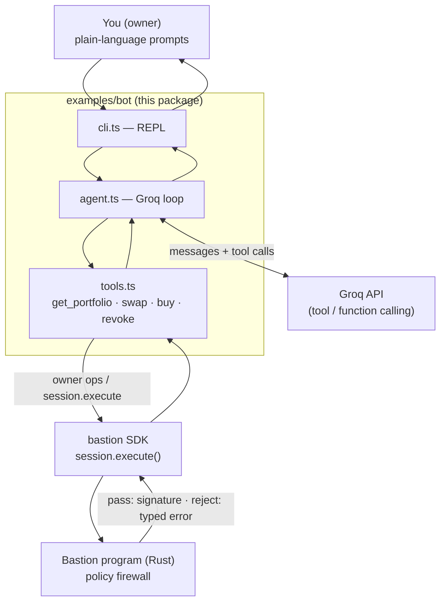
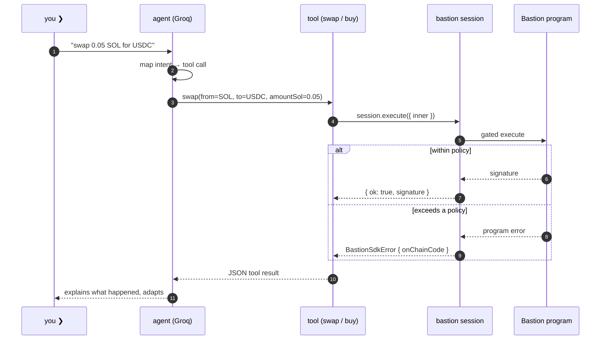

# Bastion agent CLI

A reference consumer of the [`bastion`](../../sdk) SDK: an **interactive, Groq-powered CLI agent** whose every on-chain action is gated by Bastion policies. You talk to it in plain language — _"swap 0.05 SOL for USDC"_, _"buy BONK with 0.02 SOL"_, _"what's my portfolio?"_ — and it maps your intent to a tool call that runs through a Bastion session. Exceed a policy and the chain rejects; the SDK surfaces a typed error, and the agent reads it and adapts.

The owner holds the wallet. The agent only ever holds a scoped **session key**. Bastion is the firewall between them.

## Architecture



The agent doesn't know about Bastion — it just sees tools, calls them, and reads results. The owner gets a wallet that's safe to delegate to software they don't fully trust.

## How one turn works



## Run

```bash
cp examples/bot/.env.example examples/bot/.env
# set GROQ_API_KEY (required); RPC_URL + OWNER_SECRET for a live chain
pnpm -F @examples/bot dev
```

No-network smoke test (validates wiring; no Groq, no chain):

```bash
pnpm -F @examples/bot demo
```

## Tools the agent has

| Tool                        | Effect                                                                                                                                                                                               |
| --------------------------- | ---------------------------------------------------------------------------------------------------------------------------------------------------------------------------------------------------- |
| `get_portfolio()`           | Reads `session.state()`, `session.policies()`, `session.delegateBalance()`. No tx.                                                                                                                   |
| `swap(from, to, amountSol)` | Demo: a `System::Transfer` stand-in routed through `session.execute()` (real DEX routing drops in at `buildTransferIx` in `tools.ts`). Returns a signature, or a typed error the agent can react to. |
| `buy(token, amountSol)`     | Same Bastion-gated path as `swap`.                                                                                                                                                                   |
| `revoke(reason)`            | Permanent kill switch — the chain rejects every later `execute`; the CLI exits.                                                                                                                      |

## The policy envelope

Attached on startup (`policies.ts`). Every one is enforced **on-chain**:

| Policy                             | Value            | Error on violation         |
| ---------------------------------- | ---------------- | -------------------------- |
| `SpendCap` (native SOL, 1d window) | 1 SOL total      | `SPEND_CAP_EXCEEDED`       |
| `AmountPerCall` (native SOL)       | 0.1 SOL / call   | `AMOUNT_PER_CALL_EXCEEDED` |
| `MaxCallsTotal`                    | 10 actions       | `MAX_CALLS_EXCEEDED`       |
| `CooldownPeriod`                   | 5s between calls | `COOLDOWN_ACTIVE`          |
| `MaxPriorityFee`                   | 50,000 µlamports | `PRIORITY_FEE_TOO_HIGH`    |
| `MaxComputeUnits`                  | 400,000          | `COMPUTE_UNITS_TOO_HIGH`   |

When any of these fail, the agent receives the typed error in the tool result, learns the boundary, and adapts on the next turn.
