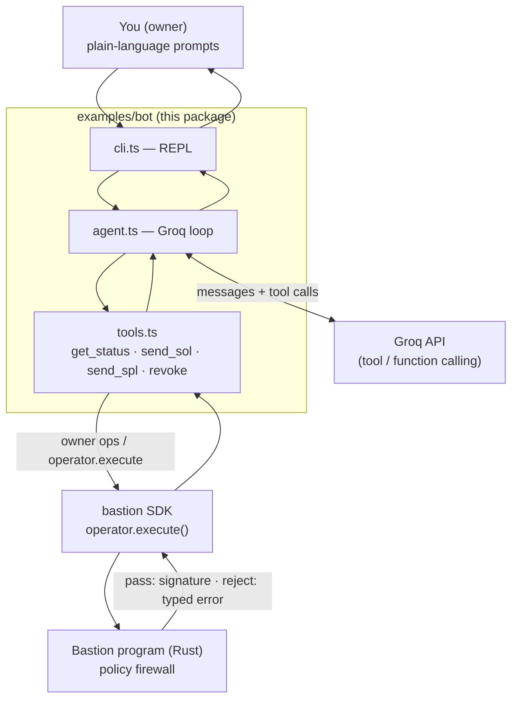
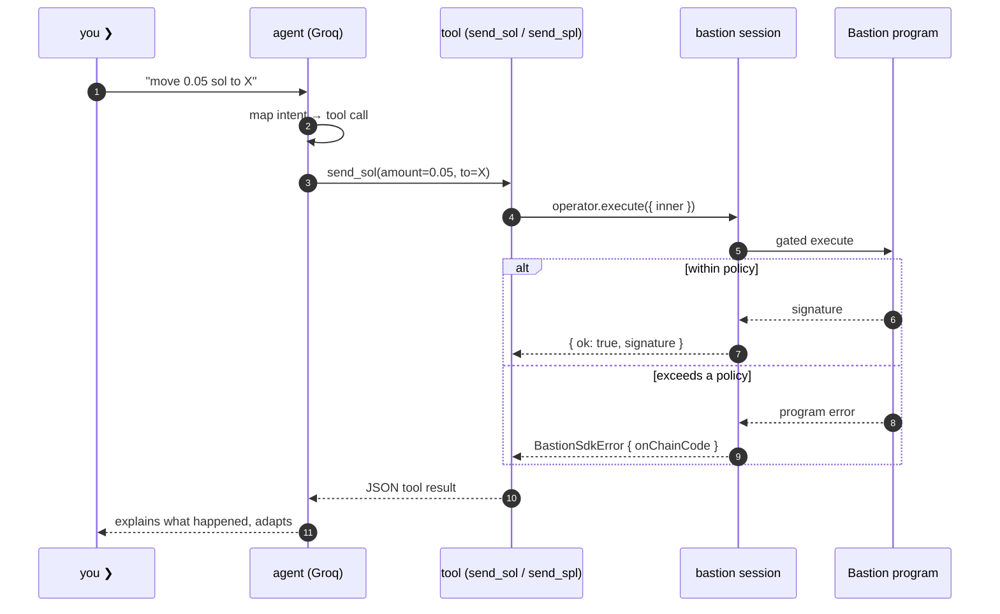

# Agent CLI

A reference consumer of the [`bastion`](../../sdk) SDK: an **interactive, Groq-powered CLI agent** whose every on-chain action is gated by Bastion policies. You talk to it in plain language — _"move 0.05 sol to `X`"_, _"send 4 spl to `Y`"_, _"what's my vault status?"_ — and it maps your intent to a tool call that runs through a Bastion session. Exceed a policy and the chain rejects; the SDK surfaces a typed error, and the agent reads it and adapts.

The owner holds the wallet. The agent only ever holds a scoped **session key** that can spend from a pre-funded **delegate vault** within hard caps. Bastion is the firewall between them.

Everything runs against a **local test validator**. A one-shot provisioner spins it up, generates the wallet + SPL mint, funds them, and drops the artifacts in `temp/` — no `.env` chain config to fill in.

## Quick start

```bash
# 1. Build the Bastion program (once)
anchor run build-sbf

# 2. Provision: boots the validator, generates temp/{owner,mint,config}.json,
#    airdrops SOL, mints tokens. Leaves the validator running — keep it open.
pnpm -F @examples/bot provision

# 3. In a second terminal: set your Groq key, then run the agent
cp examples/bot/.env.example examples/bot/.env   # set GROQ_API_KEY
pnpm -F @examples/bot demo
```

Then talk to it:

```
you ❯ move 0.05 sol to 7xKXtg2CW87d97TXJSDpbD5jBkheTqA83TZRuJosgAsU
you ❯ send 4 spl to 7xKXtg2CW87d97TXJSDpbD5jBkheTqA83TZRuJosgAsU
you ❯ try to move 5 sol to that address       # rejected: AmountPerCallExceeded
you ❯ what's my vault status?
```

## What the provisioner creates

`scripts/setup.sh` (`pnpm provision`) writes to `examples/bot/temp/` (git-ignored):

| File          | Contents                                                              |
| ------------- | --------------------------------------------------------------------- |
| `owner.json`  | Owner keypair — payer, SPL mint authority, token holder.              |
| `mint.json`   | The SPL mint keypair.                                                 |
| `config.json` | `rpcUrl`, `wsUrl`, `mint`, `decimals`, `symbol` — what the bot loads. |

On first run the bot opens a Bastion session, writes the operator credential to `temp/operator.json`, and **funds the delegate vault** from the owner (SOL + tokens) plus a little SOL on the session key for fees. Re-runs reuse the session.

## Architecture


```mermaid
flowchart TB
    User["You (owner)<br/>plain-language prompts"]
    subgraph CLI["examples/bot (this package)"]
        REPL["cli.ts — REPL"]
        Agent["agent.ts — Groq loop"]
        Tools["tools.ts<br/>get_status · send_sol · send_spl · revoke"]
    end
    Groq["Groq API<br/>(tool / function calling)"]
    SDK["bastion SDK<br/>operator.execute()"]
    Program["Bastion program (Rust)<br/>policy firewall"]

    User --> REPL --> Agent
    Agent <-->|messages + tool calls| Groq
    Agent --> Tools
    Tools -->|owner ops / operator.execute| SDK
    SDK --> Program
    Program -->|pass: signature · reject: typed error| SDK
    SDK --> Tools --> Agent --> REPL --> User
```

The agent doesn't know about Bastion — it just sees tools, calls them, and reads results. The owner gets a wallet that's safe to delegate to software they don't fully trust.

## How one turn works


```mermaid
sequenceDiagram
    autonumber
    participant U as you ❯
    participant A as agent (Groq)
    participant T as tool (send_sol / send_spl)
    participant S as bastion session
    participant C as Bastion program

    U->>A: "move 0.05 sol to X"
    A->>A: map intent → tool call
    A->>T: send_sol(amount=0.05, to=X)
    T->>S: operator.execute({ inner })
    S->>C: gated execute
    alt within policy
        C-->>S: signature
        S-->>T: { ok: true, signature }
    else exceeds a policy
        C-->>S: program error
        S-->>T: BastionSdkError { onChainCode }
    end
    T-->>A: JSON tool result
    A-->>U: explains what happened, adapts
```

## Tools the agent has

| Tool                   | Effect                                                                                                                            |
| ---------------------- | --------------------------------------------------------------------------------------------------------------------------------- |
| `get_status()`         | Reads `session.state()`, `session.policies()`, and the vault's SOL + token balances. No tx.                                       |
| `send_sol(amount, to)` | A `System::Transfer` from the delegate vault to `to`, routed through `operator.execute()`. Returns a signature, or a typed error. |
| `send_spl(amount, to)` | An SPL token transfer from the delegate's token vault to `to` (its ATA is created idempotently first). Same Bastion-gated path.   |
| `revoke(reason)`       | Permanent kill switch — the chain rejects every later `execute`; the CLI exits.                                                   |

## The policy envelope

Attached on session open (`policies.ts`). Every one is enforced **on-chain**:

| Policy                        | Value               | Error on violation         |
| ----------------------------- | ------------------- | -------------------------- |
| `ProgramAllowlist`            | System + Token only | `PROGRAM_NOT_ALLOWED`      |
| `SpendCap` (SOL, 1d window)   | 1 SOL / day         | `SPEND_CAP_EXCEEDED`       |
| `AmountPerCall` (SOL)         | 0.1 SOL / send      | `AMOUNT_PER_CALL_EXCEEDED` |
| `SpendCap` (token, 1d window) | 100 tokens / day    | `SPEND_CAP_EXCEEDED`       |
| `AmountPerCall` (token)       | 10 tokens / send    | `AMOUNT_PER_CALL_EXCEEDED` |
| `MaxCallsTotal`               | 20 actions          | `MAX_CALLS_EXCEEDED`       |
| `CooldownPeriod`              | 5s between sends    | `COOLDOWN_ACTIVE`          |
| `MaxPriorityFee`              | 50,000 µlamports    | `PRIORITY_FEE_TOO_HIGH`    |
| `MaxComputeUnits`             | 400,000             | `COMPUTE_UNITS_TOO_HIGH`   |

When any of these fail, the agent receives the typed error in the tool result, learns the boundary, and adapts on the next turn.
