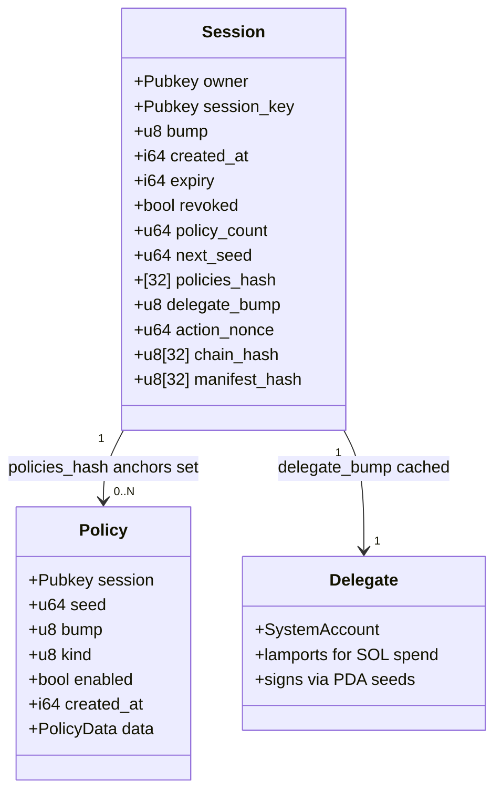
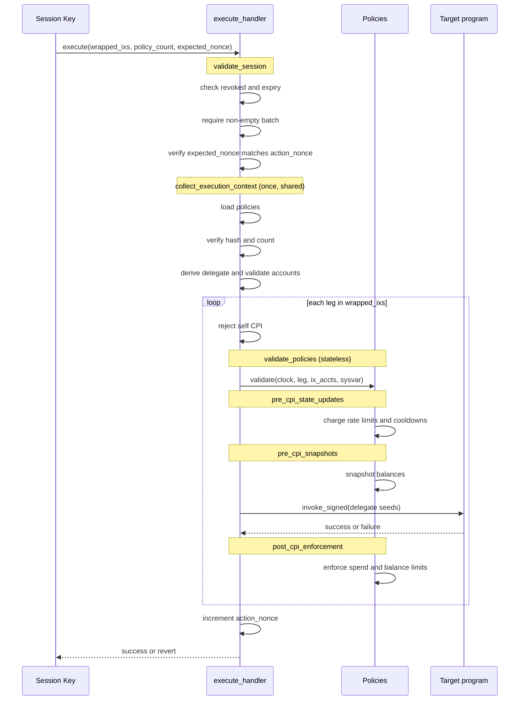
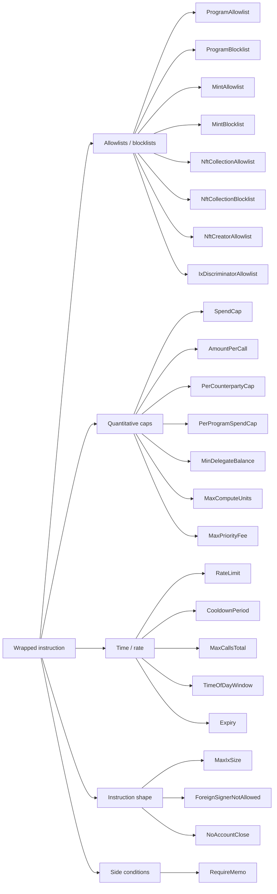
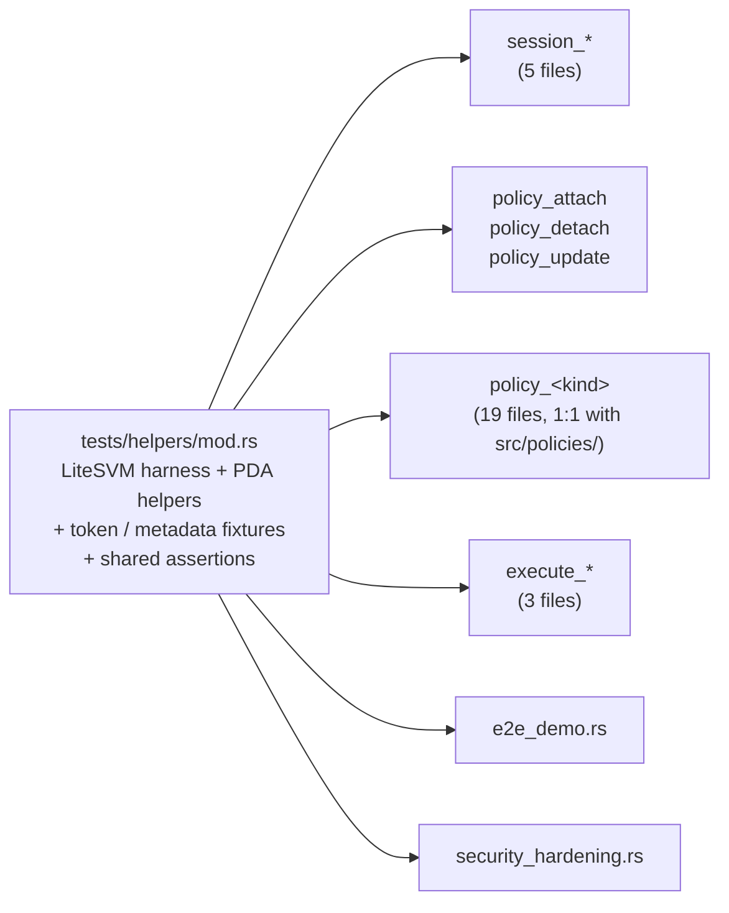

# `bastion` — on-chain program

The Anchor program that enforces every policy at runtime. This README covers the program's architecture; for the whole-project pitch see the root [README](../../README.md).

---

## Account model



PDA seeds:

| Account      | Seeds                                                                          |
| ------------ | ------------------------------------------------------------------------------ |
| **Session**  | `["session", owner, session_key]`                                              |
| **Policy**   | `["policy", session, seed_le_u64]` (seed = `Session.next_seed` at attach time) |
| **Delegate** | `["delegate", owner, session_key]` (bump cached on Session)                    |

`Session.policies_hash` is a **SHA-256** commitment over the set of child Policy keys (blake3 is inactive on mainnet-feature-set validators). `execute` rejects any caller that doesn't pass the exact set that hashes to this commitment. That defends against an old / forged / partial policy set being substituted at call time. `Session.action_nonce` is a monotonic counter (one `+1` per `execute`) used for optional multi-tx ordering via `expected_nonce`.

**Two-key model:** `init_session` enforces `session_key ≠ owner`. The owner (holder) is the only signer for every admin instruction; the session key (operator) can only call `execute`. See [ARCHITECTURE.md §3](../../ARCHITECTURE.md#3-the-two-key-trust-model).

---

## Instructions

| Instruction      | Signer      | Purpose                                                                                                                                                                                                                                                                                                                         |
| ---------------- | ----------- | ------------------------------------------------------------------------------------------------------------------------------------------------------------------------------------------------------------------------------------------------------------------------------------------------------------------------------- |
| `init_session`   | owner       | Create the Session PDA. Caches `delegate_bump` at init so `execute` skips a costly canonical-bump search.                                                                                                                                                                                                                       |
| `attach_policy`  | owner       | Append a Policy PDA at `next_seed`, re-hash, bump `policy_count`.                                                                                                                                                                                                                                                               |
| `update_policy`  | owner       | Replace `policy.data` in place; kind must be preserved (reuses the allocation; reallocs for new data length).                                                                                                                                                                                                                   |
| `detach_policy`  | owner       | Close one Policy PDA, re-hash remaining set.                                                                                                                                                                                                                                                                                    |
| `revoke_session` | owner       | Idempotent flip of `session.revoked = true`. Disables `execute` immediately.                                                                                                                                                                                                                                                    |
| `extend_session` | owner       | Monotonically advance `session.expiry`. Rejects on revoked / already-expired / non-monotonic.                                                                                                                                                                                                                                   |
| `close_session`  | owner       | Close Session + every child Policy in one atomic tx. Owner must pass every child in `remaining_accounts`.                                                                                                                                                                                                                       |
| `sweep_delegate` | owner       | Drain Delegate lamports back to owner. Requires session to be revoked first.                                                                                                                                                                                                                                                    |
| `pin_manifest`   | owner       | Pin (or rotate) the commitment to a holder-signed stateless-policy manifest. Zero un-pins. (advanced tier)                                                                                                                                                                                                                      |
| `execute`        | session_key | Wrap a **batch** of inner ixs through the policy pipeline and CPI each via the Delegate PDA. `execute(wrapped_ixs: Vec<WrappedInstruction>, policy_count, expected_nonce: Option<u64>, manifest: Option<Vec<PolicyData>>)` — atomic across legs; bumps `action_nonce`; advances `chain_hash`; optional ed25519-signed manifest. |

---

## The `execute` pipeline

`execute` is the only hot path. Everything else mutates state once per owner action.



Why two phases for spend policies:

- **Pre-CPI snapshot** captures `delegate.lamports()` (or the receiver's, for `PerCounterpartyCap`) before the wrapped ix mutates anything.
- The CPI runs through `invoke_signed` against the Delegate PDA.
- **Post-CPI** re-reads the same balances, computes the delta, and charges the windowed counters. A negative delegate delta is an outflow that decrements SpendCap; a positive receiver delta is an inflow that decrements PerCounterpartyCap.

This is the only way to enforce "you can spend at most X SOL per 24h" without trusting the wrapped instruction's bytes — the program parses _only_ the standard ComputeBudget wire format for CU/priority-fee policies; for everything else the _effect_ on accounts is what's enforced.

---

## Policy kinds

24 variants, grouped by what they constrain:



| Variant                                | Asset / scope                           | State                             | Notes                                                    |
| -------------------------------------- | --------------------------------------- | --------------------------------- | -------------------------------------------------------- |
| `ProgramAllowlist` / `Blocklist`       | program_id of wrapped ix                | stateless                         | sorted at attach; binary-search at validate              |
| `MintAllowlist` / `Blocklist`          | SPL/T22 token-account mint scan         | stateless                         | scans `ix_accounts` for token accounts                   |
| `NftCollectionAllowlist` / `Blocklist` | Metaplex `collection.key`               | stateless                         | reads metadata account                                   |
| `NftCreatorAllowlist`                  | Metaplex `creators` (verified only)     | stateless                         | rejects empty creator list at attach                     |
| `IxDiscriminatorAllowlist`             | first 8 data bytes, scoped to a program | stateless                         | sorted at attach                                         |
| `SpendCap`                             | NativeSol / SplToken / Token2022        | `SpendState` (Fixed or Rolling)   | pre/post delta; enforces rent-exempt floor for NativeSol |
| `AmountPerCall`                        | NativeSol / SPL                         | stateless                         | per-execute outflow cap                                  |
| `PerCounterpartyCap`                   | receiver pubkey + asset                 | `sent: u64`                       | charges _inflow at receiver_, not delegate outflow       |
| `PerProgramSpendCap`                   | wrapped ix's program + asset            | `SpendState` (Fixed or Rolling)   | out-of-scope txs are a full no-op                        |
| `MinDelegateBalance`                   | delegate.lamports()                     | stateless                         | post-CPI floor, composes with rent-exempt min            |
| `MaxComputeUnits`                      | outer-tx ComputeBudget ix               | stateless                         | requires explicit `SetComputeUnitLimit` ≤ max            |
| `MaxPriorityFee`                       | outer-tx ComputeBudget ix               | stateless                         | `SetComputeUnitPrice` ≤ max (no ix → 0 → passes)         |
| `RateLimit`                            | call count, scope-filtered              | `CounterState` (Fixed or Rolling) | charge happens pre-CPI                                   |
| `CooldownPeriod`                       | last call ts, scope-filtered            | `last_call_ts: i64`               | scope = optional program filter                          |
| `MaxCallsTotal`                        | lifetime call counter                   | `used: u64`                       | `used` preserved across `update_policy`                  |
| `TimeOfDayWindow`                      | UTC `start..end` minutes + days_mask    | stateless                         | days mask: bit `i` = day `i`                             |
| `Expiry`                               | wall-clock `not_after`                  | stateless                         | per-policy expiry, not session expiry                    |
| `MaxIxSize`                            | accounts.len() + data.len()             | stateless                         | rejects zero caps at attach                              |
| `ForeignSignerNotAllowed`              | inner ix's signer flags                 | stateless                         | only the delegate may be a signer in the CPI             |
| `NoAccountClose`                       | SPL Token CloseAccount discriminator    | stateless                         | hard-codes SPL Token id check                            |
| `RequireMemo`                          | outer tx must contain a memo ix         | stateless                         | reads instructions sysvar                                |

`Asset` variants: `NativeSol`, `SplToken(mint)`, `Token2022(mint)`, `NftCountInCollection(_)` _(reserved)_, `AnyNftCount` _(reserved)_. The NFT-count asset variants are rejected at attach time on caps that haven't implemented NFT counting yet.

`WindowKind` variants: `Fixed { secs }` (resets at the boundary) or `Rolling { secs, slots }` (sliding ring of up to 8 slots).

---

## Errors

53 error variants. Source of truth: [`src/error.rs`](src/error.rs). Grouped by category:

| Category                    | Variants                                                                                                                                                                                                        |
| --------------------------- | --------------------------------------------------------------------------------------------------------------------------------------------------------------------------------------------------------------- |
| **Session lifecycle**       | `SessionRevoked`, `SessionExpired`, `SessionNotRevoked`, `NewExpiryNotGreater`, `SessionInvalidSigner`, `SessionKeyIsOwner`                                                                                     |
| **Policy bookkeeping**      | `ForeignPolicy`, `PolicyDisabled`, `PolicyHashMismatch`, `PolicyCountMismatch`, `PolicyTooMany`, `PolicyKindMismatch`, `InvalidPolicyData`, `InitialPolicyCountMismatch`                                        |
| **Allowlists / blocklists** | `ProgramNotAllowed`, `ProgramBlocked`, `MintNotAllowed`, `MintBlocked`, `NftCollectionNotAllowed`, `NftCollectionBlocked`, `NftCreatorNotAllowed`, `IxDiscriminatorNotAllowed`                                  |
| **Caps & floors**           | `SpendCapExceeded`, `RentExemptFloorViolation`, `DelegateBalanceTooLow`, `AmountPerCallExceeded`, `MaxCallsExceeded`, `CounterpartyCapExceeded`, `ProgramSpendCapExceeded`                                      |
| **Rate / time**             | `RateLimitExceeded`, `CooldownActive`, `OutsideAllowedTime`, `ExpiryViolation`                                                                                                                                  |
| **Ix shape / batch**        | `IxTooLarge`, `ForeignSignerNotAllowed`, `AccountCloseNotAllowed`, `MissingRequiredMemo`, `InvalidCompactMeta`, `ComputeUnitsTooHigh`, `PriorityFeeTooHigh`, `SelfCpiNotAllowed`, `EmptyBatch`, `NonceMismatch` |
| **Manifest (advanced)**     | `ManifestNotPinned`, `ManifestHashMismatch`, `ManifestSignatureInvalid`, `ManifestPolicyNotStateless`                                                                                                           |
| **Token / NFT parsing**     | `NotAnNftMint`, `UnsupportedTokenProgram`, `InvalidMetadataAccount`                                                                                                                                             |
| **Infra**                   | `NumericalOverflow`, `InvalidPda`, `InvalidWindow`, `ListTooLong`                                                                                                                                               |

---

## Test architecture

Integration tests live in `tests/`, one file per program area. Naming convention:

| Prefix      | What it covers                         | Examples                                                                                                     |
| ----------- | -------------------------------------- | ------------------------------------------------------------------------------------------------------------ |
| `session_*` | Session lifecycle ops                  | `session_init.rs`, `session_extend.rs`, `session_close.rs`, `session_revoke.rs`, `session_sweep_delegate.rs` |
| `policy_*`  | Policy lifecycle + per-policy behavior | `policy_attach.rs`, `policy_spend_cap.rs`, `policy_rate_limit.rs`, … (one file per policy kind)              |
| `execute_*` | `execute` internals + composition      | `execute_validation.rs`, `execute_dispatch.rs`, `execute_composition.rs`                                     |
| `e2e_*`     | End-to-end flows                       | `e2e_demo.rs`                                                                                                |
| (other)     | Cross-cutting                          | `harness.rs`, `security_hardening.rs`                                                                        |

The shared LiteSVM harness, helpers, and fixtures live in `tests/helpers/mod.rs`. Every test file declares `mod helpers;` and uses central helpers (`setup_funded_session`, `extras_sol_transfer_one_policy`, `set_cu_limit_ix`, `set_cu_price_ix`).



---

## Build & test

```bash
# build SBF .so + IDL
anchor build

# Rust unit tests (counter math, hash, wire-format parsers, …)
anchor run testunit                     # or: anchor run testunit

# Full integration suite (LiteSVM, ~120 tests across 33 files)
anchor run testsvm                     # or: anchor run testsvm

# A single test crate
cargo test --test policy_spend_cap
cargo test --test session_extend
cargo test --test execute_composition

# A single test by name
cargo test --test policy_rate_limit -- rate_limit_rolling_window
```
