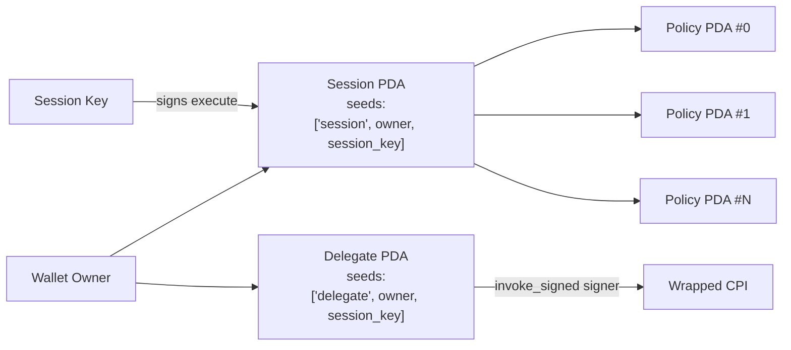
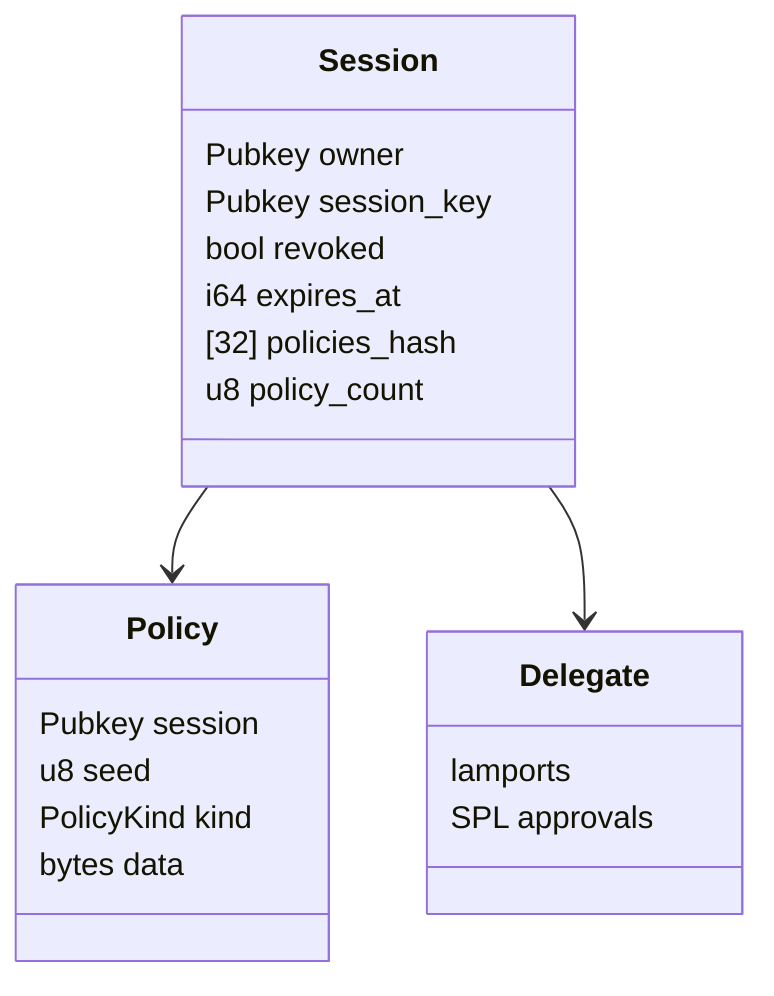
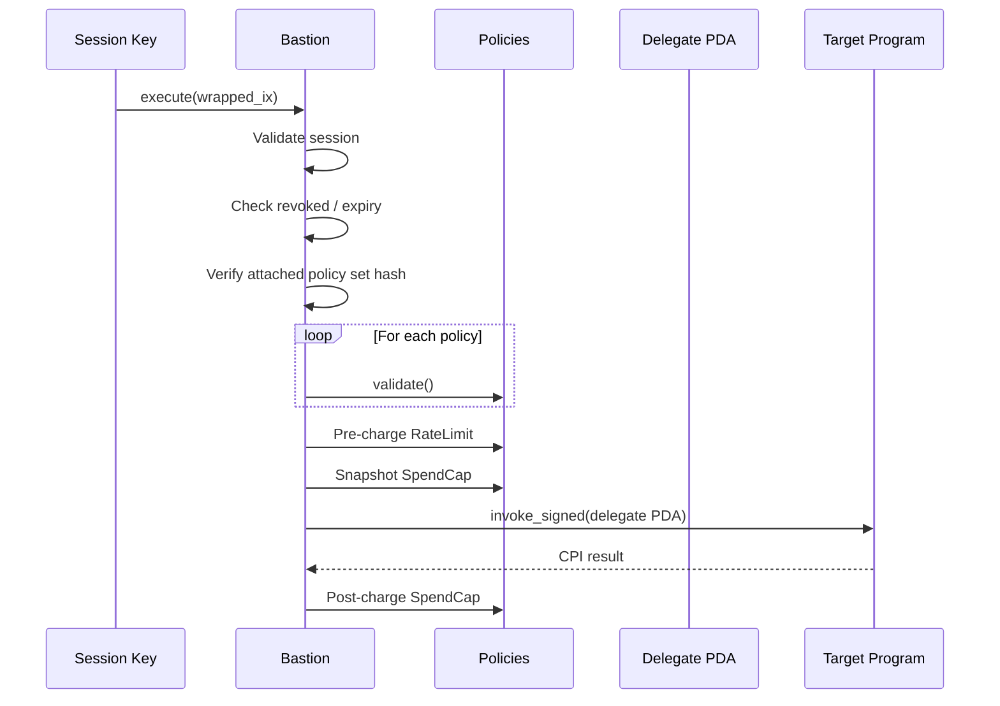
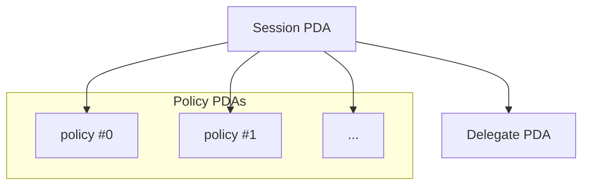
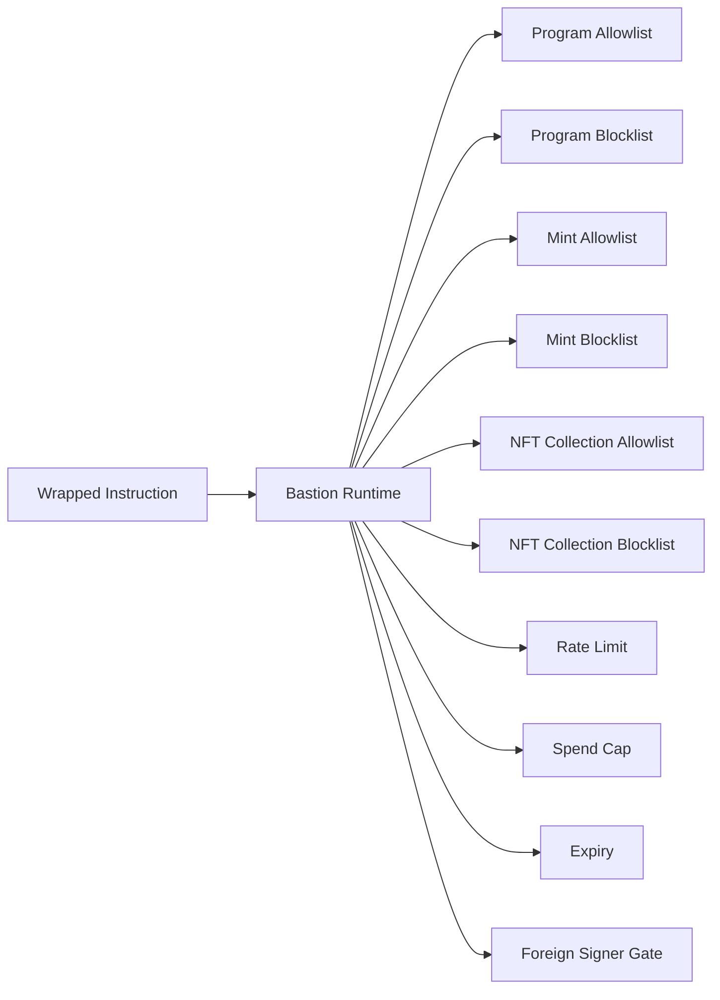

# Bastion

Programmable policy runtime for Solana session keys.

The Bastion on-chain program lets wallets delegate constrained authority to
session keys through composable policy accounts enforced at runtime.
---

# High-level Architecture



---

# Account Model



---

# Execute Flow

`execute(wrapped_ix)` is the hot path.



---

# PDA Layout



---

# Instructions

| Instruction      | Signer      | Purpose                                           |
| ---------------- | ----------- | ------------------------------------------------- |
| `init_session`   | owner       | Create a Session PDA                              |
| `attach_policy`  | owner       | Attach a new Policy PDA and re-hash session state |
| `update_policy`  | owner       | Replace policy data (kind-preserving realloc)     |
| `detach_policy`  | owner       | Remove Policy PDA and re-hash session             |
| `revoke_session` | owner       | Permanently revoke a session                      |
| `close_session`  | owner       | Close Session + child Policies                    |
| `sweep_delegate` | owner       | Drain Delegate PDA lamports                       |
| `execute`        | session_key | Execute wrapped CPI through policy runtime        |

---

# Policy Runtime



---

# Policy Kinds

* `ProgramAllowlist`
* `ProgramBlocklist`
* `MintAllowlist`
* `MintBlocklist`
* `NftCollectionAllowlist`
* `NftCollectionBlocklist`
* `RateLimit`
* `SpendCap`

  * `NativeSol`
  * `SplToken`
  * `Token2022`
* `Expiry`
* `ForeignSignerNotAllowed`

---

# Development

```bash
# Build the project
anchor build

# Run all tests
anchor run testsvm

# Run a single integration suite
cargo test -p bastion --test test_demo_scenario
```

LiteSVM integration tests embed the generated `.so` directly via
`include_bytes!`, so the SBF build must be rebuilt before running tests.

---

# Test Architecture

```mermaid
flowchart TD
    Harness["tests/common/mod.rs\nLiteSVM harness\nPDA helpers\ntoken/NFT fixtures"]

    Init["test_init_session.rs"]
    Revoke["test_revoke_session.rs"]
    Close["test_close_session.rs"]

    Attach["test_attach_policy.rs"]
    Detach["test_detach_policy.rs"]
    Update["test_update_policy.rs"]

    Execute["test_execute_skeleton.rs"]
    ExecutePolicies["test_execute_policies.rs"]

    Program["test_program_lists.rs"]
    Mint["test_mint_lists.rs"]
    NFT["test_nft_collection.rs"]

    Rate["test_rate_limit.rs"]
    Spend["test_spend_cap.rs"]

    Demo["test_demo_scenario.rs"]

    Harness --> Init
    Harness --> Revoke
    Harness --> Close
    Harness --> Attach
    Harness --> Detach
    Harness --> Update
    Harness --> Execute
    Harness --> ExecutePolicies
    Harness --> Program
    Harness --> Mint
    Harness --> NFT
    Harness --> Rate
    Harness --> Spend
    Harness --> Demo
```

