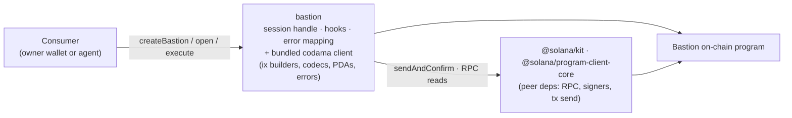
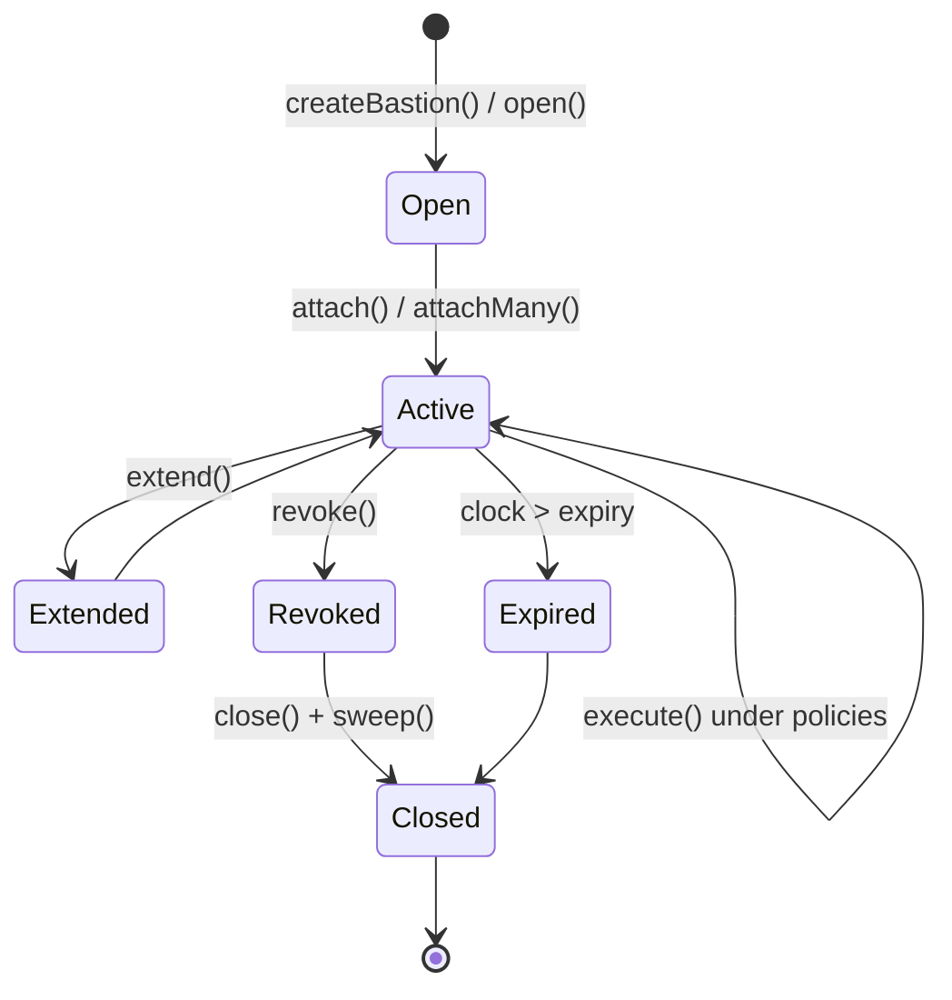
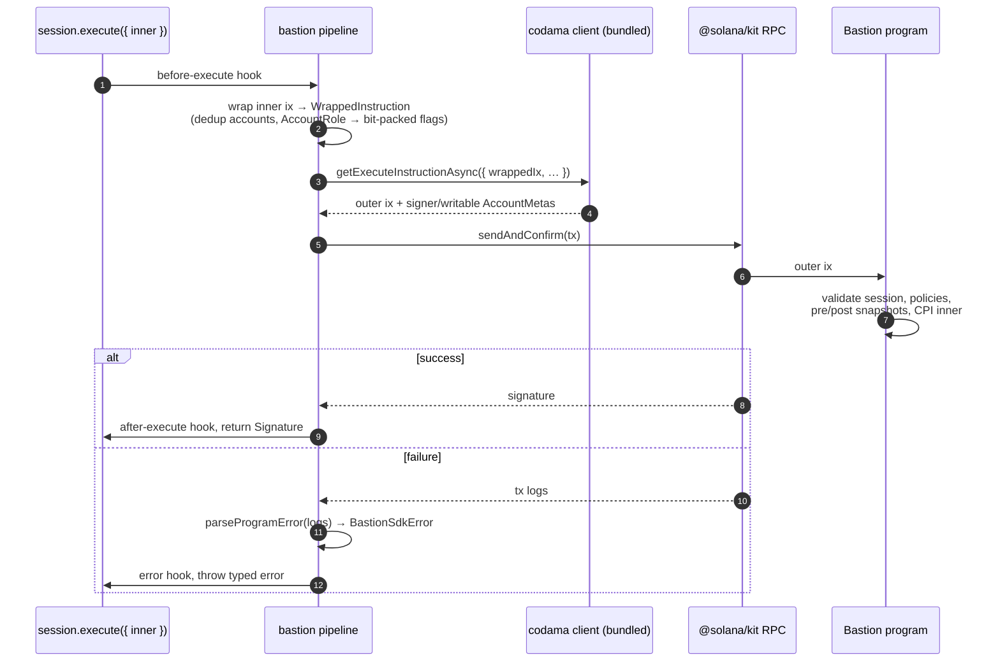

# Bastion

TypeScript SDK for the **Bastion** on-chain program — a policy firewall for Solana. Hand an agent (or any session holder) a scoped session key; every action it takes is gated on-chain by the policies you attach. The SDK is the thin handle over that: session lifecycle, an `execute` pipeline with hooks, and a typed error surface — so you write `session.execute({ inner })` instead of assembling instructions, snapshots, and account metas by hand.

The codama-generated client (instruction builders, codecs, PDA derivers, error constants, and the `policyData` / `asset` / `windowKind` factories) is **bundled into this package** and re-exported from the top level. You install one package and import everything from `bastion`.

## Install

```bash
pnpm add bastion @solana/kit @solana/program-client-core
```

`@solana/kit` and `@solana/program-client-core` are **peer dependencies** — bring your own. ESM-only.

## Quick start

```ts
import {
    createBastion,
    sol,
    hours,
    days,
    EMPTY_SPEND_STATE,
    BastionSdkError,
    policyData,
    asset,
    windowKind,
} from "bastion";
import type { Instruction } from "@solana/kit";

// `wallet` is a @solana/kit TransactionSigner — the owner key.
const bastion = createBastion({
    url: "https://api.devnet.solana.com",
    wallet,
    logger: { level: "info" },
});

// 1. Open a session (owner-signed). A per-session key is generated and held
//    in-memory inside the handle — the owner key is never exposed again.
const session = await bastion.session.open({
    expiry: { secsFromNow: hours(1) },
});
console.log(session.pubkey, session.sessionKey.address);

// 2. Attach the policy envelope. `policyData(...)` output is passed verbatim.
await session.attachMany([
    policyData("SpendCap", {
        asset: asset("NativeSol"),
        window: windowKind("Fixed", { secs: days(1) }),
        max: sol(1),
        state: EMPTY_SPEND_STATE,
    }),
    policyData("AmountPerCall", { asset: asset("NativeSol"), max: sol(0.1) }),
    policyData("MaxCallsTotal", { max: 10n, used: 0n }),
]);

// 3. Hand `session` to your agent. Every execute() is validated on-chain.
const inner: Instruction = /* any @solana/kit instruction */ buildSwap();
try {
    const signature = await session.execute({ inner });
} catch (err) {
    if (err instanceof BastionSdkError) {
        // e.g. "AmountPerCallExceeded" — the chain rejected; learn the boundary.
        console.error(err.code, err.onChainCode);
    }
}

// 4. Kill switch (owner-signed).
await session.revoke();
```

## Architecture



The SDK exists only for what codama can't generate: the session state machine, account ordering for `execute`, kit `AccountRole` → Bastion bit-packed flag translation, program-error parsing, hooks, and unit math. Everything else is the codama client, surfaced as-is.

## Session lifecycle



Owner-only ops (`attach`, `attachMany`, `update`, `detach`, `extend`, `revoke`, `close`, `sweep`) sign with `wallet`. The one session-side op (`execute`) signs with the per-session `SessionSigner` held inside the handle. That separation is the whole point — the agent only ever holds the session key, never the owner key.

```ts
// Owner side, signs with wallet:
await session.attach(policyData(...));      // one policy
await session.attachMany([...]);            // many, sequential
await session.update(seed, policyData(...));
await session.detach(seed);
await session.extend(newExpiry);
await session.revoke();
await session.close();
await session.sweep(destination);

// Reads (no signature):
await session.state();            // Session account (revoked, expiry, …)
await session.policies();         // attached Policy accounts
await session.delegateBalance();  // lamports in the spend pool
await session.isExpired();

// Rebind an existing session without a tx:
const s = await bastion.session.hydrate({ pubkey, sessionKey });
```

## Policies are codama types — first-class

There is **no policy-builder layer** in this SDK. You construct policy data with codama's factories (re-exported from `bastion`) and pass the result to `attach` verbatim:

```ts
import { asset, microLamports, policyData, sol, windowKind } from "bastion";

policyData("SpendCap", {
    asset: asset("NativeSol"),
    window: windowKind("Fixed", {
        secs: days(1),
    }),
    max: sol(1),
    state: EMPTY_SPEND_STATE,
});

policyData("AmountPerCall", {
    asset: asset("NativeSol"),
    max: sol(0.1),
});

policyData("MaxCallsTotal", {
    max: 10n,
    used: 0n,
});

policyData("CooldownPeriod", {
    secs: 5,
    lastCallTs: 0n,
    scope: null,
});

policyData("MaxPriorityFee", {
    maxMicroLamports: microLamports(50_000),
});

policyData("MaxComputeUnits", {
    max: 400_000,
});
```

Unit helpers — `sol`, `lamports`, `microLamports`, `tokens`, `seconds`, `minutes`, `hours`, `days`, `weeks` — and the empty-state constants `EMPTY_SPEND_STATE` / `EMPTY_COUNTER_STATE` are also exported from `bastion`.

## The execute pipeline

The hot path. Everything else is owner-side bookkeeping; `execute` is what the agent calls in production.



`execute` also accepts `policies?`, `computeUnitLimit?`, `computeUnitPrice?`, and `memo?` alongside `inner`.

## Hooks

`before` / `after` / `error` for every owner-side op and `execute`. The context is a discriminated union — the `op` / `kind` field narrows to the right shape. Use them for observability, metrics, replay logging, or retry gating; core logic stays in the pipeline.

```ts
const bastion = createBastion({
    url,
    wallet,
    hooks: {
        before(ctx) {
            log(`${ctx.op} starting…`);
        },
        after(ctx) {
            log(`${ctx.op} ok in ${Date.now() - ctx.startedAt}ms`);
        },
        error(ctx) {
            warn(`${ctx.op} failed → ${ctx.error.code}`);
        },
    },
});
```

## Typed errors

Chain rejections surface as `BastionSdkError`, with the parsed on-chain error name:

```ts
import { BastionSdkError } from "bastion";

try {
    await session.execute({ inner });
} catch (err) {
    if (err instanceof BastionSdkError) {
        err.code; // SDK-level reason
        err.onChainCode; // e.g. "SpendCapExceeded" | "CooldownActive" | …
        err.logs; // raw program logs, when available
    }
}
```

`parseProgramError` and `wrapSendError` are exported for advanced cases.
